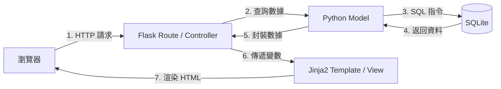

# 系統架構設計 (ARCHITECTURE) - 漫畫推薦系統

## 1. 技術架構說明

本專案採用傳統的 **MVC (Model-View-Controller)** 模式進行開發，利用 Flask 框架作為核心，確保開發效率與結構清晰。

### 選用技術與原因
- **後端：Python + Flask**
    - 原因：Flask 是輕量級框架，擴展性強，適合快速原型開發與小型專案。
- **模板引擎：Jinja2**
    - 原因：Flask 內建支援，能直接在後端渲染 HTML 頁面，減少前後端溝通成本，並支援模板繼承（如 `layout.html`）。
- **資料庫：SQLite**
    - 原因：免安裝配置、單檔案儲存，非常適合開發練習與教學用途，且足以應付本系統的初期數據量。

### MVC 模式分工
- **Model (模型)**：負責定義資料表結構與資料存取邏輯。
- **View (視圖)**：負責顯示 HTML 頁面與呈現數據給使用者。
- **Controller (控制器)**：負責處理 HTTP 請求、調用 Model 數據並選擇適當的 View 進行渲染。

---

## 2. 專案資料夾結構

```text
web_app_development2/
├── app/
│   ├── __init__.py         # 應用程式初始化 (工廠模式)
│   ├── models/             # 資料庫模型 (定義 Manga, Comment 等)
│   ├── routes/             # 路由處理 (分類、搜尋、閱讀邏輯)
│   ├── templates/          # Jinja2 HTML 模板
│   │   ├── layout.html     # 基本佈局
│   │   ├── index.html      # 首頁 (排行榜)
│   │   ├── search.html     # 搜尋結果
│   │   ├── manga_detail.html # 漫畫詳細資訊
│   │   └── reader.html     # 閱讀器頁面
│   └── static/             # 靜態資源 (CSS, JS, 圖片)
├── docs/                   # 專案設計文件
│   ├── PRD.md
│   └── ARCHITECTURE.md
├── instance/               # 實例資料夾
│   └── database.db         # SQLite 資料庫檔案
├── .agents/                # AI Agent Skills (開發工具)
├── app.py                  # 應用程式入口
└── requirements.txt        # 依賴套件清單
```

---

## 3. 元件關係圖

### 資料與請求流向
使用 Mermaid 語法表示系統運作流程：



---

## 4. 關鍵設計決策

1. **伺服器端渲染 (SSR)**：
   為了簡化開發流程，我們選擇不進行前後端分離，而是透過 Jinja2 在 Flask 伺服器端直接生成 HTML。這對於 SEO 友善且減少了 AJAX 調用的複雜度。

2. **閱讀器狀態切換 (下拉/翻頁)**：
   雖然是 SSR 架構，但閱讀模式的即時切換將結合基礎的 JavaScript 在前端處理 CSS 類別（Class）的更換，以提供流暢的用戶體驗。

3. **SQLite 直接讀寫**：
   本練習將直接使用 `sqlite3` 庫或簡易的 SQL 操作，讓組員能直接接觸 SQL 語法，強化對關聯式資料庫的理解。

4. **Blueprint 路由管理**：
   隨後將採用 Flask Blueprint 將「搜尋」、「分類」、「閱讀」等邏輯模組化，避免單一檔案過於龐大。
