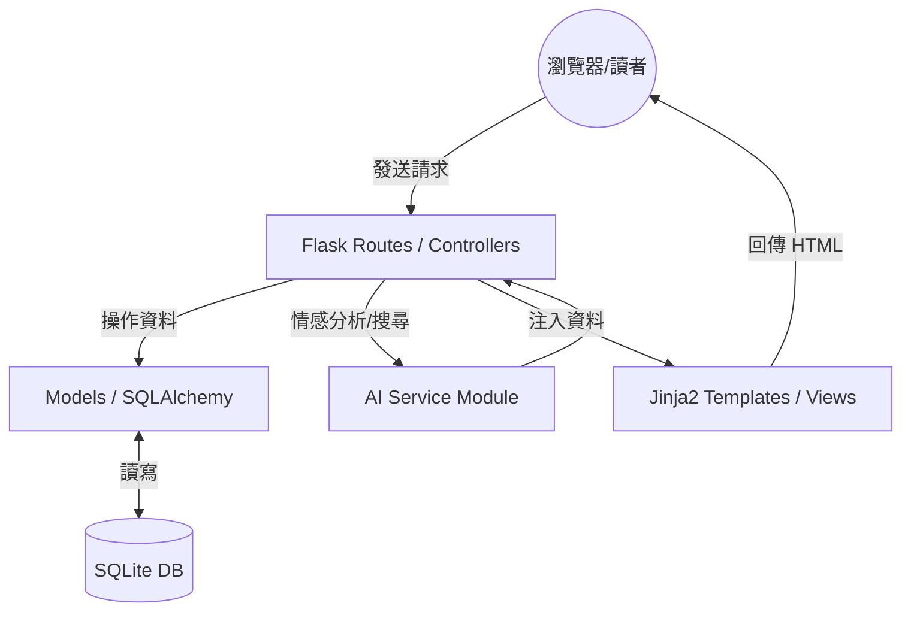

# 系統架構設計 (ARCHITECTURE) - 漫遊索引系統

## 1. 技術架構說明

本專案採用 **Flask MVC (Model-View-Controller)** 模式進行開發，將資料儲存、業務邏輯與介面顯示進行解耦，以提升代碼的可維護性。

### 選用技術
- **後端框架**：Flask (Python) - 輕量、靈活，適合快速原型開發。
- **模板引擎**：Jinja2 - Flask 內建，負責動態生成 HTML 頁面。
- **資料庫**：SQLite - 零設定、伺服器端資料庫檔案，適合中小型應用與開發測試。
- **樣式與交互**：Vanilla CSS + Javascript - 提供豐富的視覺效果與微動畫，確保「精品級」的使用者體驗。

### MVC 模式分工
- **Model (模型)**：負責與 SQLite 資料庫互動，定義資料結構（如用戶資訊、漫畫清單、閱讀進度）。
- **View (視圖)**：由 Jinja2 模板組成，負責將資料渲染成讀者看到的 HTML 網頁。
- **Controller (控制器)**：即 Flask 的路由（Routes），處理使用者的請求，呼叫 Model 取得資料後傳遞給 View。

---

## 2. 專案資料夾結構

```text
web_app_development2/
├── app/
│   ├── __init__.py          # 應用程式初始化 (App Factory)
│   ├── models/              # 資料庫模型 (Models)
│   │   ├── user.py          # 使用者資料
│   │   ├── comic.py         # 漫畫資訊與標籤
│   │   └── progress.py      # 閱讀進度紀錄
│   ├── routes/              # 路由與業務邏輯 (Controllers)
│   │   ├── main.py          # 首頁與通用邏輯
│   │   ├── auth.py          # 登入與註冊
│   │   ├── library.py       # 跨平台書櫃管理
│   │   ├── search.py        # AI 推薦與畫風搜尋
│   │   └── community.py     # 漫話室與評論區
│   ├── services/            # 核心服務邏輯 (AI Engine)
│   │   └── ai_logic.py      # 情感推薦與圖像分析模擬邏輯
│   ├── templates/           # Jinja2 HTML 模板 (Views)
│   │   ├── base.html        # 共用佈局 (導覽列、頁尾)
│   │   ├── index.html       # 首頁
│   │   ├── login.html       # 登入頁
│   │   ├── library.html     # 書櫃頁面
│   │   └── comic_detail.html# 漫畫詳情與評論
│   └── static/              # 靜態資源
│       ├── css/             # 樣式表 (CSS)
│       ├── js/              # 腳本 (JS)
│       └── uploads/         # 用戶上傳的畫風搜尋圖片
├── docs/                    # 專案文件 (PRD, Architecture, etc.)
├── instance/                # 實例資料夾 (SQLite 檔案存放處)
│   └── database.db          # 實際的資料庫檔案
├── app.py                   # 專案啟動入口
├── requirements.txt         # 依賴套件清單
└── README.md                # 專案說明
```

---

## 3. 元件關係圖



---

## 4. 關鍵設計決策

1. **集中式書櫃入口**：
   - *決策*：將不同平台的進度儲存在同一個 `Progress` 模型中，並記錄「來源平台」欄位。
   - *原因*：解決漫畫散落各處的問題，讓讀者在一個地方就能掌握所有動態。

2. **多維度標籤系統**：
   - *決策*：資料庫設計支持「類別標籤」與「情緒標籤」共存。
   - *原因*：為了實現 AI 情感推薦引擎，情緒標籤是媒合讀者當下心理需求的關鍵。

3. **畫風視覺檢索模擬**：
   - *決策*：MVP 階段將透過提取圖像 Metadata 或預定義標籤進行模擬媒合。
   - *原因*：在不增加過多算力成本的情況下，先驗證「視覺搜尋」對用戶的價值。

4. **互動式避雷機制**：
   - *決策*：在評論模型中加入特定的 `warning_type` 欄位（如：爛尾、虐主）。
   - *原因*：比傳統 5 星評分更能提供具體的風險警示，減少用戶的時間損失。

---

## 5. 接下來的步驟
- 根據架構文件，開始 **Phase 3: 流程圖設計 (Flowchart)**，視覺化使用者在這些目錄下的操作路徑。
