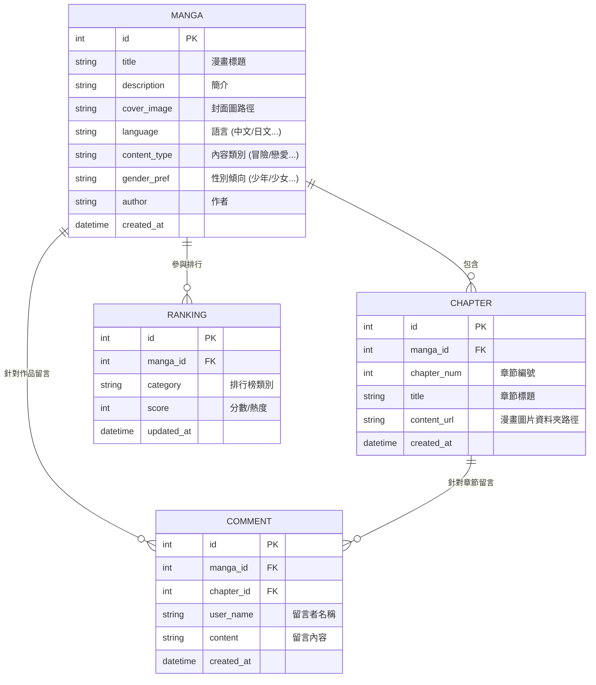

# 資料庫設計 (DB DESIGN) - 漫畫推薦系統

## 1. ER 圖 (實體關係圖)



---

## 2. 資料表詳細說明

### 2.1 `mangas` 表
| 欄位 | 型別 | 說明 | 必填 |
| :--- | :--- | :--- | :--- |
| id | INTEGER | Primary Key, 自動遞增 | 是 |
| title | TEXT | 漫畫書名 | 是 |
| description | TEXT | 漫畫簡介 | 否 |
| cover_image | TEXT | 封面圖片檔案路徑 | 否 |
| language | TEXT | 語言分類 (例如: 繁體中文, 日文) | 是 |
| content_type | TEXT | 內容題材 (例如: 冒險, 科幻, 懸疑) | 是 |
| gender_pref | TEXT | 性別傾向 (例如: 少年向, 少女向, 青年向) | 是 |
| author | TEXT | 作者名稱 | 否 |
| created_at | DATETIME | 建立時間 | 是 |

### 2.2 `chapters` 表
| 欄位 | 型別 | 說明 | 必填 |
| :--- | :--- | :--- | :--- |
| id | INTEGER | Primary Key, 自動遞增 | 是 |
| manga_id | INTEGER | Foreign Key (關聯到 mangas.id) | 是 |
| chapter_num | INTEGER | 第幾章 | 是 |
| title | TEXT | 章節標題 (例如: 第一話) | 否 |
| content_url | TEXT | 儲存該章節所有圖片的資料夾路徑 | 是 |
| created_at | DATETIME | 建立時間 | 是 |

### 2.3 `comments` 表
| 欄位 | 型別 | 說明 | 必填 |
| :--- | :--- | :--- | :--- |
| id | INTEGER | Primary Key, 自動遞增 | 是 |
| manga_id | INTEGER | Foreign Key (關聯到 mangas.id) | 是 |
| chapter_id | INTEGER | Foreign Key (關聯到 chapters.id) | 是 |
| user_name | TEXT | 訪客顯示名稱 | 是 |
| content | TEXT | 留言內容 | 是 |
| created_at | DATETIME | 建立時間 | 是 |

### 2.4 `rankings` 表
| 欄位 | 型別 | 說明 | 必填 |
| :--- | :--- | :--- | :--- |
| id | INTEGER | Primary Key, 自動遞增 | 是 |
| manga_id | INTEGER | Foreign Key (關聯到 mangas.id) | 是 |
| category | TEXT | 排行榜類型 (例如: 'weekly_hot', 'rating') | 是 |
| score | INTEGER | 評分或熱度值 | 是 |
| updated_at | DATETIME | 最後更新時間 | 是 |

---

## 3. SQL 建表語法

儲存於 `database/schema.sql`：

```sql
-- 建立漫畫主表
CREATE TABLE IF NOT EXISTS mangas (
    id INTEGER PRIMARY KEY AUTOINCREMENT,
    title TEXT NOT NULL,
    description TEXT,
    cover_image TEXT,
    language TEXT NOT NULL,
    content_type TEXT NOT NULL,
    gender_pref TEXT NOT NULL,
    author TEXT,
    created_at DATETIME DEFAULT CURRENT_TIMESTAMP
);

-- 建立章節表
CREATE TABLE IF NOT EXISTS chapters (
    id INTEGER PRIMARY KEY AUTOINCREMENT,
    manga_id INTEGER NOT NULL,
    chapter_num INTEGER NOT NULL,
    title TEXT,
    content_url TEXT NOT NULL,
    created_at DATETIME DEFAULT CURRENT_TIMESTAMP,
    FOREIGN KEY (manga_id) REFERENCES mangas (id)
);

-- 建立留言表
CREATE TABLE IF NOT EXISTS comments (
    id INTEGER PRIMARY KEY AUTOINCREMENT,
    manga_id INTEGER NOT NULL,
    chapter_id INTEGER NOT NULL,
    user_name TEXT NOT NULL,
    content TEXT NOT NULL,
    created_at DATETIME DEFAULT CURRENT_TIMESTAMP,
    FOREIGN KEY (manga_id) REFERENCES mangas (id),
    FOREIGN KEY (chapter_id) REFERENCES chapters (id)
);

-- 建立排行榜表
CREATE TABLE IF NOT EXISTS rankings (
    id INTEGER PRIMARY KEY AUTOINCREMENT,
    manga_id INTEGER NOT NULL,
    category TEXT NOT NULL,
    score INTEGER DEFAULT 0,
    updated_at DATETIME DEFAULT CURRENT_TIMESTAMP,
    FOREIGN KEY (manga_id) REFERENCES mangas (id)
);
```
