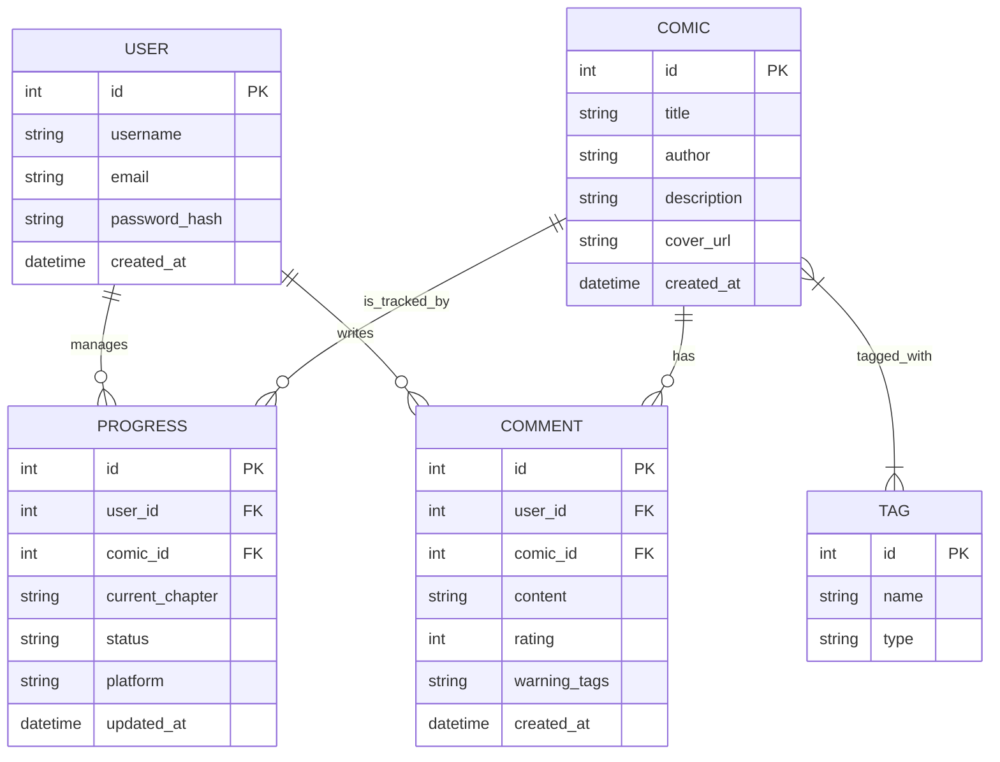

# 資料庫設計 (DB DESIGN) - 漫遊索引系統

## 1. ER 圖 (Entity Relationship Diagram)



---

## 2. 資料表詳細說明

### USER (使用者)
| 欄位 | 型別 | 說明 | 必填 |
| :--- | :--- | :--- | :--- |
| id | INTEGER | 主鍵，自動遞增 | 是 |
| username | TEXT | 使用者名稱，唯一 | 是 |
| email | TEXT | 電子郵件，唯一 | 是 |
| password_hash | TEXT | 加密後的密碼 | 是 |
| created_at | DATETIME| 帳號建立時間 | 是 |

### COMIC (漫畫作品)
| 欄位 | 型別 | 說明 | 必填 |
| :--- | :--- | :--- | :--- |
| id | INTEGER | 主鍵，自動遞增 | 是 |
| title | TEXT | 作品標題 | 是 |
| author | TEXT | 作者名稱 | 是 |
| description | TEXT | 作品簡介 | 否 |
| cover_url | TEXT | 封面圖片 URL | 否 |
| created_at | DATETIME| 系統錄入時間 | 是 |

### TAG (標籤)
| 欄位 | 型別 | 說明 | 必填 |
| :--- | :--- | :--- | :--- |
| id | INTEGER | 主鍵，自動遞增 | 是 |
| name | TEXT | 標籤名稱 (如：致鬱、燃、韓漫) | 是 |
| type | TEXT | 標籤類型 (emotion / category) | 是 |

### PROGRESS (閱讀進度)
| 欄位 | 型別 | 說明 | 必填 |
| :--- | :--- | :--- | :--- |
| id | INTEGER | 主鍵，自動遞增 | 是 |
| user_id | INTEGER | 外鍵，關聯至 USER | 是 |
| comic_id | INTEGER | 外鍵，關聯至 COMIC | 是 |
| current_chapter| TEXT | 目前閱讀章節 | 否 |
| status | TEXT | 狀態 (reading, completed, dropped) | 是 |
| platform | TEXT | 來源平台 (LINE, Kakao, Webtoon) | 否 |
| updated_at | DATETIME| 最後更新時間 | 是 |

### COMMENT (評論與避雷)
| 欄位 | 型別 | 說明 | 必填 |
| :--- | :--- | :--- | :--- |
| id | INTEGER | 主鍵，自動遞增 | 是 |
| user_id | INTEGER | 外鍵，關聯至 USER | 是 |
| comic_id | INTEGER | 外鍵，關聯至 COMIC | 是 |
| content | TEXT | 評論內容 | 是 |
| rating | INTEGER | 評分 (1-5) | 是 |
| warning_tags | TEXT | 避雷標籤 (如：爛尾、虐主，以逗號分隔) | 否 |
| created_at | DATETIME| 評論時間 | 是 |

---

## 3. SQL 建表語法 (database/schema.sql)

```sql
-- 使用者表
CREATE TABLE IF NOT EXISTS users (
    id INTEGER PRIMARY KEY AUTOINCREMENT,
    username TEXT UNIQUE NOT NULL,
    email TEXT UNIQUE NOT NULL,
    password_hash TEXT NOT NULL,
    created_at DATETIME DEFAULT CURRENT_TIMESTAMP
);

-- 漫畫表
CREATE TABLE IF NOT EXISTS comics (
    id INTEGER PRIMARY KEY AUTOINCREMENT,
    title TEXT NOT NULL,
    author TEXT NOT NULL,
    description TEXT,
    cover_url TEXT,
    created_at DATETIME DEFAULT CURRENT_TIMESTAMP
);

-- 標籤表
CREATE TABLE IF NOT EXISTS tags (
    id INTEGER PRIMARY KEY AUTOINCREMENT,
    name TEXT NOT NULL,
    type TEXT NOT NULL -- emotion or category
);

-- 漫畫與標籤關聯表
CREATE TABLE IF NOT EXISTS comic_tags (
    comic_id INTEGER,
    tag_id INTEGER,
    PRIMARY KEY (comic_id, tag_id),
    FOREIGN KEY (comic_id) REFERENCES comics (id) ON DELETE CASCADE,
    FOREIGN KEY (tag_id) REFERENCES tags (id) ON DELETE CASCADE
);

-- 閱讀進度表
CREATE TABLE IF NOT EXISTS progress (
    id INTEGER PRIMARY KEY AUTOINCREMENT,
    user_id INTEGER NOT NULL,
    comic_id INTEGER NOT NULL,
    current_chapter TEXT,
    status TEXT DEFAULT 'reading', -- reading, completed, dropped
    platform TEXT,
    updated_at DATETIME DEFAULT CURRENT_TIMESTAMP,
    FOREIGN KEY (user_id) REFERENCES users (id) ON DELETE CASCADE,
    FOREIGN KEY (comic_id) REFERENCES comics (id) ON DELETE CASCADE
);

-- 評論表
CREATE TABLE IF NOT EXISTS comments (
    id INTEGER PRIMARY KEY AUTOINCREMENT,
    user_id INTEGER NOT NULL,
    comic_id INTEGER NOT NULL,
    content TEXT NOT NULL,
    rating INTEGER CHECK (rating >= 1 AND rating <= 5),
    warning_tags TEXT, -- 存儲為 "爛尾,虐主" 等格式
    created_at DATETIME DEFAULT CURRENT_TIMESTAMP,
    FOREIGN KEY (user_id) REFERENCES users (id) ON DELETE CASCADE,
    FOREIGN KEY (comic_id) REFERENCES comics (id) ON DELETE CASCADE
);
```
