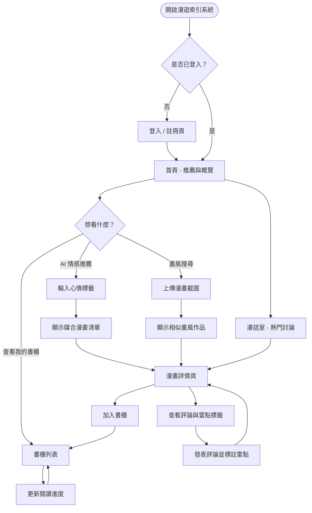
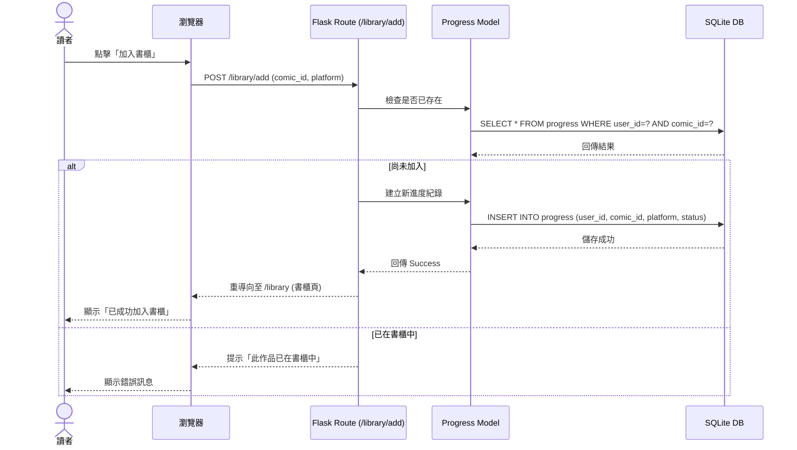

# 流程圖設計 (FLOWCHART) - 漫遊索引系統

## 1. 使用者流程圖 (User Flow)

描述讀者從進入網站到使用各項核心功能的的操作路徑。

---

## 2. 系統序列圖 (Sequence Diagram)

描述「將漫畫加入跨平台書櫃」的完整資料流轉過程。

---

## 3. 功能清單對照表

| 功能模組 | URL 路徑 | HTTP 方法 | 說明 |
| :--- | :--- | :--- | :--- |
| **首頁** | `/` | GET | 顯示推薦作品與系統公告 |
| **登入/註冊** | `/auth/login` | GET, POST | 用戶身份驗證 |
| **情感搜尋** | `/search/ai` | GET, POST | 處理心情標籤並回傳推薦清單 |
| **畫風搜尋** | `/search/art` | POST | 接收圖片上傳並進行視覺分析 |
| **書櫃首頁** | `/library` | GET | 列出用戶收藏的所有漫畫 |
| **加入書櫃** | `/library/add` | POST | 將作品加入個人書櫃 |
| **更新進度** | `/library/update`| POST | 記錄讀者在不同平台的最新進度 |
| **漫畫詳情** | `/comic/<int:id>`| GET | 顯示作品介紹、標籤與評論 |
| **發表評論** | `/comic/<int:id>/comment`| POST | 提交評論內容與雷點標籤 |

---

## 4. 接下來的步驟
- 根據流程圖與功能對照表，開始 **Phase 4: 資料庫設計 (Database Design)**。
- 定義 User, Comic, Progress, Comment 等資料表的欄位關聯。
