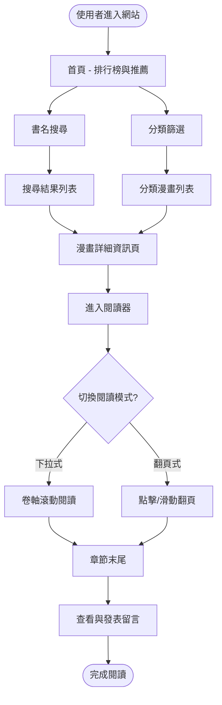
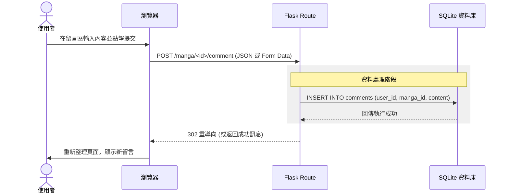

# 流程圖設計 (FLOWCHART) - 漫畫推薦系統

## 1. 使用者流程圖 (User Flow)

描述使用者從進入首頁到完成閱讀與留言的操作路徑。

---

## 2. 系統序列圖 (Sequence Diagram)

以「發表留言」為例，描述資料在各元件之間的傳遞流程。

---

## 3. 功能清單對照表

| 功能名稱 | URL 路徑 | HTTP 方法 | 說明 |
| :--- | :--- | :--- | :--- |
| 首頁 (排行榜) | `/` | GET | 顯示各類別 Top 10 |
| 搜尋結果 | `/search` | GET | 根據關鍵字過濾漫畫 |
| 分類篩選 | `/category/<type>` | GET | 顯示特定分類的漫畫列表 |
| 漫畫詳情 | `/manga/<id>` | GET | 顯示簡介與章節列表 |
| 閱讀器 | `/manga/<id>/read` | GET | 核心閱讀介面 (含模式切換) |
| 發表留言 | `/manga/<id>/comment` | POST | 儲存使用者心得 |

---

## 說明
- **使用者流程圖**：確保了使用者可以透過多種途徑（搜尋或分類）抵達目標內容，並能順利進入核心的閱讀與互動環節。
- **序列圖**：展示了 Flask 作為中介，如何處理來自前端的互動並確保數據持久化到 SQLite。
- **對照表**：為後續的路由設計（API Design）提供了明確的藍圖。
